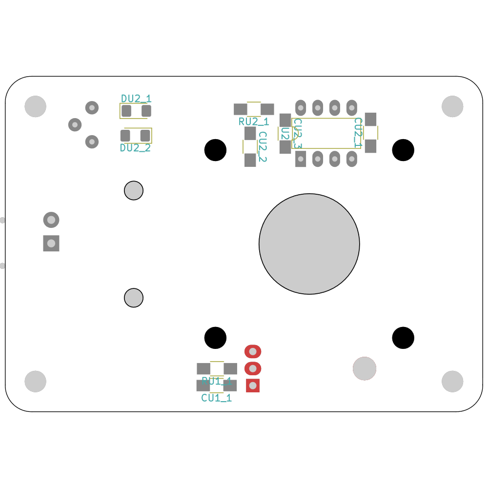

# BrightMarker: 3D Printed Fluorescent Markers for Object Tracking


   In this tutorial, we show how to embed and detect BrightMarkers for interactive applications. BrightMarker was published at [**2023 ACM Symposium on User Interface Software and Technology (UIST)**](https://uist.acm.org/2023/) . Learn more about the project [here](https://hcie.csail.mit.edu/research/brightmarker/brightmarker.html).
   
   <sub>By [Mustafa Doga Dogan](https://www.dogadogan.com/)\*†, Raul Garcia-Martin\*, Patrick William Haertel\*, Jamison John O'Keefe\*, Ahmad Taka\*, Akarsh Aurora\*, Raul Sanchez-Reillo†, and [Stefanie Mueller](https://hcie.csail.mit.edu/stefanie-mueller.html)\*</sub>
   
   <sup>\*MIT and †Universidad Carlos III de Madrid</sup>
   
   If you use BrightMarker as part of your research, please cite it as follows.
   
   > <sup>Mustafa Doga Dogan, Raul Garcia-Martin, Patrick William Haertel, Jamison John O'Keefe, Ahmad Taka, Akarsh Aurora, Raul Sanchez-Reillo, and Stefanie Mueller. 2023. BrightMarker: 3D Printed Fluorescent Markers for Object Tracking. In Proceedings of the 36th Annual ACM Symposium on User Interface Software and Technology (UIST '23). Association for Computing Machinery, New York, NY, USA, Article 55, 1–13. https://doi.org/10.1145/3586183.3606758</sup>


<p align="center">
  
</p>


## #1 CAD: Adding BrightMarkers into objects using Blender plugin

### BrightMarker Embedding Interface (BEI)

BEI is a Blender add-on that determines optimal locations/distributions on 3D models and embeds codes in them. Developed with Blender 3.4 Python API.

You may watch the following video tutorial and/or read the written instructions below (Mac users should read through the instructions as there are some differences in placing the "Arucos" folder). 

<a href="https://youtu.be/AG2zZX9qQs0" target="_blank"></a>

### Setup

1. **Install BEI.**
  
To install BEI, first download [BEI.py](blender/BEI.py). Next, open Blender, navigate to Edit -> Preferences -> Add-ons and click "Install...". Select BEI.py in your files, and the add-on will be installed. Make sure it's enabled by checking the box to the left of its name.  
  
2. **Enable LoopTools.**
  
BEI uses a Blender add-on called LoopTools. Navigate to Edit -> Preferences -> Add-ons, search "Mesh: LoopTools" (make sure that "Enabled Add-ons Only" is not checked or LoopTools won't show up), and check the box next to its name to enable it.
  
3. **Disable Auto Perspective.**
  
Navigate to Edit -> Preferences -> Navigation and make sure that Auto -> Perspective is not checked.

4. **Add ArUcos folder to Blender files**
  
**PC/Windows:** copy the ["Arucos" folder](./blender/Arucos/) to your working directory. To check your working directory, open Blender, navigate to the Scripting tab, and run the following code:
```python
import os
print(os.getcwd())
```
In Blender, click Window -> Toggle System Console. You should see a print statement with the directory in which you should place the "Arucos" folder.
In most cases, this will be your Blender program files, which are located at "C:\Program Files\Blender Foundation\Blender 3.4\" on Windows.

**Mac:** you can put the ["Arucos" folder](./blender/Arucos/) anywhere. While using the plugin, if you choose to embed ArUcos rather than using your own imported file(s), you will see an option to "Use full path (Mac)". Check this box, and input the path to your "Arucos" folder. To easily determine this path, drag and drop your "Arucos" folder into a terminal. Copy and paste this path into the "Path to 'Arucos' folder" input box that shows up after you check the previous "Use full path (Mac)" box.

<!-- To check your working directory, open Finder, navigate to Applications, ctrl + right click on Blender, and select "Show Package Contents". Navigate to Contents -> MacOS, where you should see an exec file called "Blender". Open Terminal, drag and drop this file into your terminal, and press enter. This will open a new instance of Blender. Navigate to the scripting tab, and run the following code:
```python
import bpy
print(bpy.utils.resource_path('LOCAL'))
```
You should see your working directory printed in the terminal you just used to open Blender. In most cases, this directory can be accessed by right clicking on the Blender application to show package contents, as we did above. -->

### Usage

Import your model (any 3D file type) into Blender. If you would like to embed a custom code, import it (.svg) as well. Note that the code will import as a collection of curves. Ensure that Blender is in Object Mode, and select the model you would like to embed in. Note that setting the origin of your model to the center of its base can help with code alignment.


Navigate to Object -> BrightMarker Embedding Interface.

Now you should see a popup interface with four input categories to ensure your markers are embedded as desired.

1. **Marker Locations**

    * Use manually selected points: if you would like to use this setting, you must first enter Edit Mode, select individual faces on the model at which markers should be embedded, then re-enter Object Mode.
    * Use uniformly distributed points: this mode will find the best places on the model to uniformly distribute markers. You can choose to distribute on the whole object (with or without base or selected regions), or a selected region (select this region of faces on this model in Edit Mode, then re-enter Object Mode to run the BEI) based on a fixed total number of codes, or a fixed distance between codes.

2. **Marker Content**

    * Use fixed ArUco ID: this will embed a chosen ArUco ID for all of your markers.
    * Use sequential ArUco IDs: this will embed increasing ArUco IDs (starting from a chosen ID) for each marker.
    * Use custom marker: this will embed a custom code imported as a .svg into Blender for all of your markers.

3. **Marker Specifications**

    * Use suggested thicknesses for object color: this allows you to choose the color filament that your object will be printed with to automatatically determine the optimal marker and shell thicknesses.
    * Use custom values: this allows you to choose your own shell thickness (how deep in the model the marker is embedded) and marker thickness (how thick the marker is).
    * Side length: this sets the side length of all of the markers to be embedded (e.g. a side length of 10 means your markers will be 10 x 10).

4. **Marker Alignment**

    * Align marker bottom edge: this aligns the bottom edge of each marker to a desired plane with an optional angle offset.


Once you're satisfied with your settings, click **OK** and see the results! If you wish to export STLs, you must export the model with the air gaps as one STL, and just the codes as another STL.


If you'd like to test BEI and create the objects used in the paper, see our [example objects](blender/Example%20Objects/).

## #2 3D Printing

### Exporting from Blender to Cura

Once you have embedded your codes into an object with BEI, you can export them from Blender as STLs so that they can be prepared for 3D printing with a slicer such as Cura. To export the shell of your object (this is what will be printed in normal ABS/PLA filament), select your original model as well as all the **Air Gaps** generated by BEI. 


Navigate to the export window by selecting: **File -> Export -> Stl**. Then, make sure you check **Include: Selection Only** as shown below. Name the file and export.


Repeat this process for the **Code Pieces** generated by BEI. (If you have more than one you can export them all at once.)

Once you have two STLs, one with the code pieces and the other with the air gaps, you are ready to import into Cura. 

### Setting up the model in Cura

Open the files in Cura. Select the model of the code, and choose **"Print Selected Model with Extruder 2"**. This is how the code is printed using the fluorescent filament.


Once the proper extruder is selected, we need to merge the models. This is easy in Cura. Simply select both models, right click, and choose **Merge Models** as shown below.


Make sure Extruder 1 and Extruder 2 are setup corresponding to the filaments you are using. The extruder used for the fluorescent filament (we use extruder 2) should be set to Generic ABS.

If you would like to use the same Cura settings we used, download this [Cura Profile](cura/abs_brightmarker_cura_profile.curaprofile). This profile uses dynamic layer heights so that the codes can be as detailed as possible, but the rest of the model can print at a decent speed. There are also many other parameters that have been fine tuned for our use.

To add the profile to Cura go to **Preferences -> Configure Cura -> Profiles -> Import**. This profile is designed to be used with Generic ABS in Extruder 1, but you can fine tune the profile to your needs. Once the settings are right for your printer, click **Slice**.
 
Now you can print the sliced file using your 3D printer!


## #3 Image processing with OpenCV

- **Patrick and Raul**: Provide the code, instructions on how to use it
- checkerboard calibration
- lighting conditions

Once you have 3D printed your object embedding your QR or AurUco BrightMarker, you are ready to detect and read it.
 
### Detecting and reading QR codes
**Hardware**

- Write

**Software**
- It is recommended that you use PyCharm to run the decoder demos both for QR and Aruco, however, the code can be run from a terminal.
  
- Have Python 3 and pip3 pre-installed on your system link for this is here version 3.10 or greater should work just fine
  
- Run the following command in the terminal:
  * pip install numpy opencv-contrib-python dbr
  
- Or in PyCharm navigate to File > Settings > Project > Python Interpreter > Install packages (click the plus sign) and install the following packages:

* numpy
* opencv-contrib-python
* dbr

**Instructions**

- Navigate to  > .py
- Open the file in an editor
- Navigate to line 22 and confirm that CAMERA_STREAM is the same as the IR webcam ID
  * CAMERA_STREAM = 1 works, depending on the computer. On some computers, it can be 0, 1, or 2, etc. based on if there is one or more internal webcams.
- You should see a window popup on your screen if everything went alright  

### Detecting and reading ArUco markers

**Hardware**

- Write

**Software**
- It is recommended that you use PyCharm to run the decoder demos both for QR and Aruco, however, the code can be run from a terminal.
  
- Have Python 3 and pip3 pre-installed on your system link for this is here version 3.10 or greater should work just fine
  
- Run the following command in the terminal:
  * pip install numpy opencv-contrib-python dbr
  
- Or in PyCharm navigate to File > Settings > Project > Python Interpreter > Install packages (click the plus sign) and install the following packages:

* numpy
* opencv-contrib-python
* dbr

**Camera calibration**

- Write

**Instructions**

## #4 Mobile detection with OnePlus 8 Pro

- **Raul**: LED attachment, circuit file, list of components
- refer to RGM vision app?


## #5 AR/VR detection module

### Communicating detection results to an AR/VR application

We use the User Datagram Protocol (UDP) to communicate BrightMarker(s) data to a Unity project.

You will need 3 things:
1. A Unity Project which is properly set up for your use case (AR, VR, Quest, Hololens, etc.).
2. A code detection script (which can run with an IR camera with the proper filter).
3. A data receiving script (running in your Unity hierarchy).

Items 2 and 3 have been provided in this repository (see below).

First, drag [UDPReceive.cs](./unityXR/UDPReceive.cs) into an empty GameObject in your Unity scene. Note the two variables at the top of the script:

```c#
private bool USE_UNITY_PLAY_MODE = false;
private string IP_ADDRESS = "123.45.67.890";
```
If you intend to use Quest Link (for Meta Quest headsets) or holographic remoting (for Hololens headsets), set the first variable to 'true' and ignore the second.
Quest Link and holographic remoting involve streaming Unity's play mode to a headset over Wi-Fi or via USB; in other words, you never build your application, only stream it to the headset. Note that you must run the detection script on the same computer which is running Unity for this method to work.
* [Quest Link with Unity tutorial](https://youtu.be/sSD798Ov2oY)
* [Hololens holographic remoting with Unity tutorial](https://learn.microsoft.com/en-us/windows/mixed-reality/develop/unity/tutorials/holograms-101)

If you would like to build your Unity application to the headset, set the first variable to false, and set the second to the IP address of the computer which will send the detection results to the stand-alone application (via Wi-Fi).

[Two example code detection scripts](./unityXR/code%20detection/) can be found in this repository, one for position detection, and the other z-rotation detection. 

At the tops of both scripts, you will see two variables:
```python
UDP_IP_ADDRESS = "127.0.0.2"
CAMERA_INPUT = 0
```
If you intend to use the Unity play mode (Quest Link, holographic remoting), leave the first variable as is. Otherwise, if you intend to use a standalone app, change the IP address to that of the headset you're building the app to.

**Important:** if you are going the standalone route, make sure that your headset and the computer running the detection script are on the same Wi-Fi network!

The second variable is the input number for your IR camera. If 0 doesn't work, try 1, 2, etc. until the script runs with the IR camera (instead of, for example, your integrated webcam).

It's useful to create a script which interprets the data being received by the UDPReceive.cs script. In Unity, create a new script, and add it to an empty GameObject (or any GameObject). Declare the following variable in the class constructor:
```c#
public UDPReceive udpReceive;
```
In the Unity component panel, assign the udpReceive variable to UDPReceive.cs.
Now, in the Update() method of your script, write:
```c#
string data = udpReceive.data;
Debug.Log(data);
```
This script will now output your data into the console. You can remove this Debug.log() statement, it's only there so that you can see what your data looks like and then decide how you want to parse it. For example, if what you see printed to the console is this...
```python
ArUco ID: 3, X-coord: 10, Y-coord: 20, Z-coord: 30
```
...then these might be the next lines you add to your Update() method:
```c#
string[] parts = data.Split(',');
int aruco_id = float.Parse(parts[0][10:]);
float x_position = float.Parse(data[1][10:]);
float y_position = float.Parse(data[2][10:]);
float z_position = float.Parse(data[3][10:]);
```
And now you can use these variables as you like in your project!

### CAD for Meta Quest Attachment
#### Overview

The 3D printed assembly is designed to enhance your Meta Quest VR experience. Adding IR detection to VR! 

#### Components

The assembly consists of the following 3D printed parts:

1. [Bottom](docs/Oculus%20Quest%202%20Bottom.SLDPRT) This part is the base holding the IR light PCB, 9V battery, Camera.

2. [Top_Plate](docs/Oculus%20Quest%202%20Top.SLDPRT) This part is the cover for bottom.

3. [Strap](docs/Oculus%20Quest%202%20Strap%20Plate.SLDPRT) This is the part that allows the attachment for the Oculus.


#### Files

The `docs` folder contains the 3D design files for each part in STL format, which is compatible with most 3D printers. [Assembly](docs/Oculus%20Quest%202%20Assembly.SLDASM)

####  Assembly Instructions

1. **3D Printing**: Print all parts using your 3D printer. We recommend a layer height of 0.2mm and a 20% infill. PLA filament was used for the prototypes, but other materials may also be suitable.

2. **Preparation**: Remove any support material from the 3D printed parts. You may also want to sand the parts for a smoother finish.

3. **Assembly**: Attach the Bottom Case to the Top plate using (screws). Next, attach the Strap to the assembly from step 1 using (glue).

4. **Attachment**: Attach the assembled unit to the Quest 


### IR Light PCB 
#### Materials
| Quantity | References                                  | Footprint                                   |
| -------- | ------------------------------------------- | ------------------------------------------- |
| 1        | LM317L_SO8                                  | TO-220-3_Horizontal_TabDown                 |
| 1        | LM555xM                                     | DIP-8_W7.62mm_LongPads                      |
| 1        | Pwr                                         | Switch_SPDT_CnK_JS102011JCQN_9x3.6mm_P2.5mm |
| 2        | 10uF                                        | C_1206                                      |
| 2        | 10nF                                        | C_1206                                      |
| 2        | 1N4148                                      | D_1206_3216Metric_Pad1.42x1.75mm_HandSolder |
| 1        | LED                                         | IR_LED                                      |
| 1        | MOSFET_N-CH_30V_1.7A                        | SOT-23                                      |
| 1        | IR_CAM                                      | IR_CAM                                      |
| 1        | 12.5                                        | R_1206                                      |
| 1        | 1K                                          | R_1206                                      |
| 1        | 10K                                         | Potentiometer_Bourns_3386P_Vertical         |
| 1        | Power                                       | TerminalBlock_4Ucon_1x02_P3.50mm_Horizontal |
#### Board
##### Front


###### Back


###### How to Export KiCad PCB Files for PCBWay

Follow these steps to take your KiCad PCB design files and send them to PCBWay for manufacturing.

1. Download Board 

[Board Files](docs/IR_Flashlight_pcb_v5.zip)

2. Generate Gerber Files

Gerber files are the industry-standard file format that PCB manufacturers use to manufacture your PCB.

- Open your project in KiCad's PCB layout editor (Pcbnew).
- Click on `File > Plot` to open the plot window.
- Select `Gerber` as the Plot format.
- Ensure that all relevant layers are selected (e.g., Front Copper, Back Copper, Front SilkS, Back SilkS, Front Mask, Back Mask, and Edge Cuts).
- Click `Plot` to generate the Gerber files.

3. Generate Drill Files

Drill files are used by the PCB manufacturer to know where to drill holes in the PCB.

- Still in the Plot window, go to the `Drill Files` tab.
- Select the appropriate options for your design (usually the default options are fine).
- Click `Generate Drill File`.
- Then click `Close` to close the Plot window.
 
4. Prepare for Upload

- Collect all the generated Gerber and drill files into one folder.
- Compress this folder into a .zip file for upload.

5. Upload to PCBWay

- Go to the [PCBWay website](https://www.pcbway.com/) and log into your account.
- Click `PCB Instant Quote > Quick-order PCB`.
- Click `Add your Gerber file` and select the .zip file you just created.
- Fill in the relevant details about your board (size, quantity, layers, color, etc.).
- Add the order to your cart and proceed to checkout.
- PCBWay will review the files and confirm if they can build it or ask for any necessary changes.
- After their confirmation, you can pay for your order.

