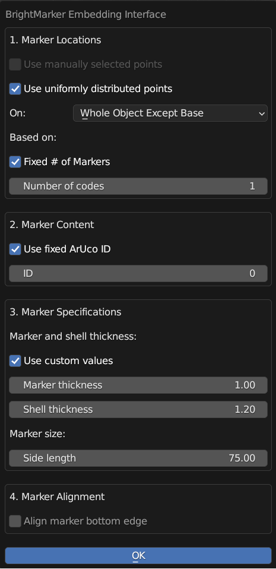
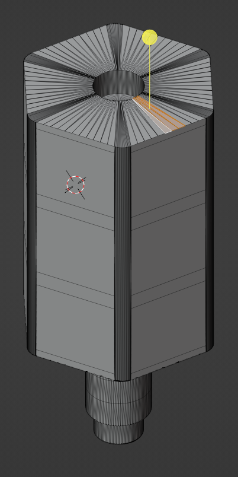
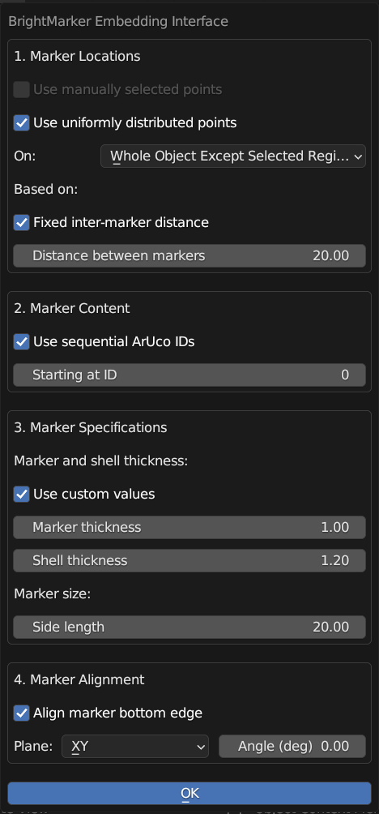
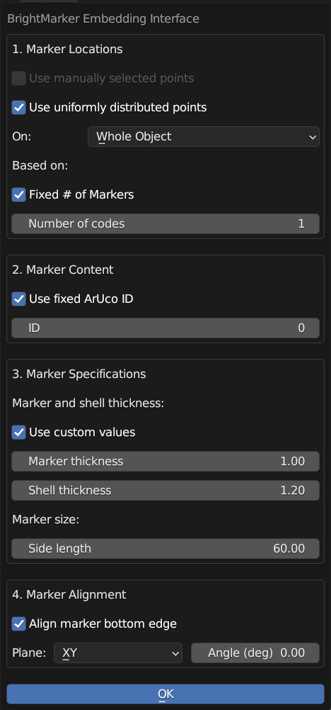
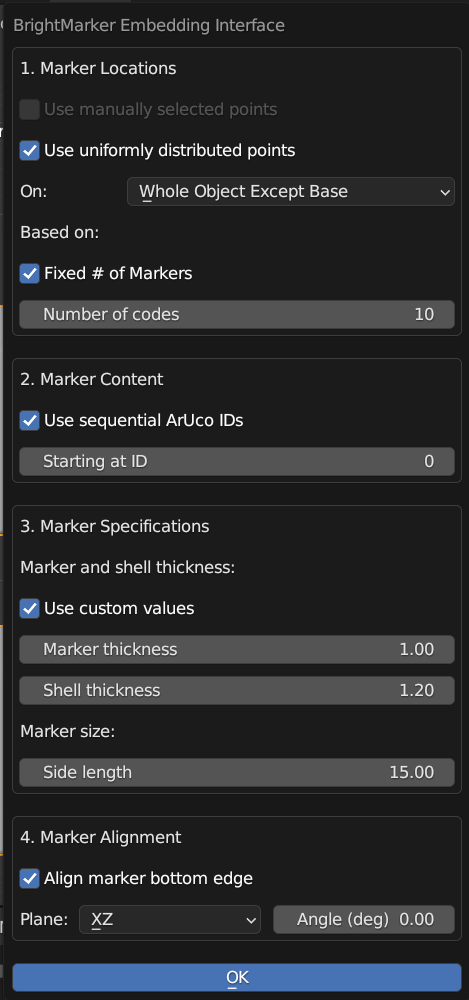

# Example Objects

Here's how we embedded BrightMarkers in the objects displayed in the paper using BEI.

Before you attempt to embed in any of the example objects, follow the guide in the BEI main folder README to ensure that your settings are correct and that you've installed BEI.

## Ping Pong Paddle

Open pingpong.blend, and run BEI on the paddle with the following settings:

## ArUco Saber

Open saber.blend, switch to Edit Mode, select a small region of faces on the top of the saber component (as below), switch back to Object Mode, and run BEI on the object with the following settings:

    
    

## Bottle

Open bottle.blend, and run BEI on the paddle with the following settings:

## Wristband

Open wristband.blend, and run BEI on the wristband with the following settings:

